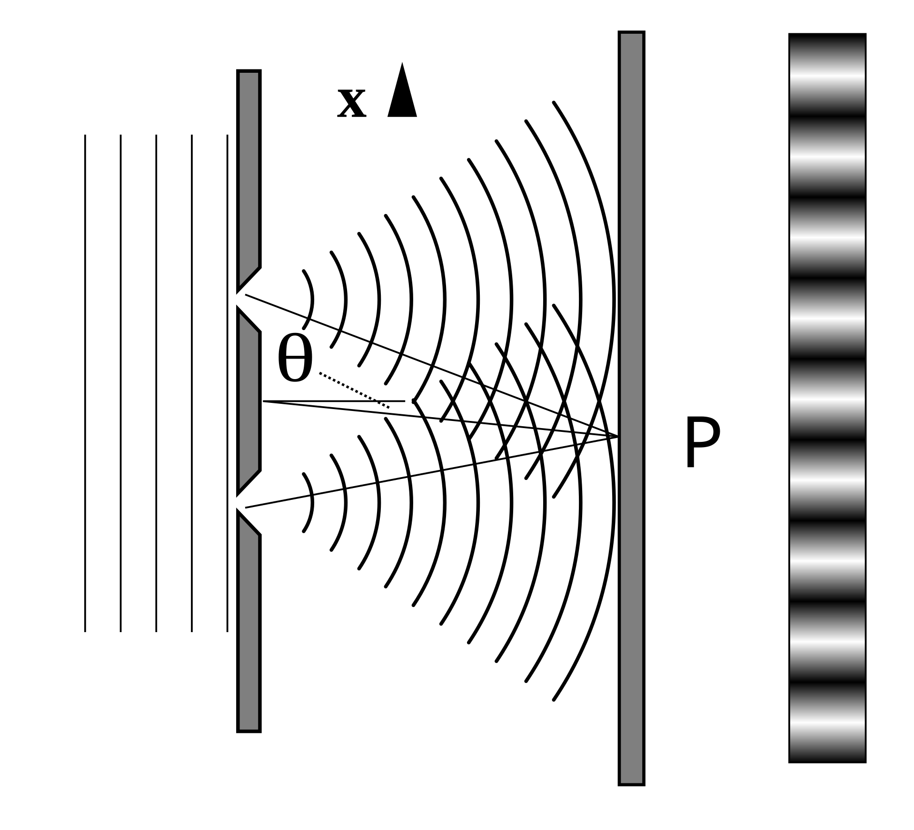

# Key Concepts and Essentials

Understanding key concepts is crucial. 
It's not enough to just know their definitions. A professional student or researcher should be able to explain them in his own words, which demonstrate true mastery.

## Coherence
Coherence expresses the potential for two waves to interfere. Two monochromatic beams from a single source always interfere. As the wave sources are not strictly mo,ochromatic: they may be partly coherent. Beams from different sources are mutually incoherent.

When interfering, two waves add together to create a wave of greater amplitude than either one (constructive interference) or subtract from each other to create a wave of minima which may be zero (destructive interference), depending on their relative phase.

Two waves with constant relative phase will be coherent.

- [Coherence (physics)](https://en.wikipedia.org/wiki/Coherence_(physics))

## Coulomb's Law
Coulomb's law, is an experimental law of physics that calculates the amount of force between two electrically charged particles at rest.

$$
|F| = k_e \frac{|q_1||q_2|}{r^2}
$$

Here, $ k_e $ is a constant, $q_1 $ and $q_2 $ are the quantities of each charge, and the scalar $r $ is the distance between the charges.

### Coloumb's Law Constant

The constant of proportionality, $ \frac{1}{4 \pi \varepsilon_0} $, in Coulomb's law:

$ \mathbf{F}_1 = \frac{q_1 q_2}{4 \pi \varepsilon_0} \frac{\hat{\mathbf{r}}_{12}}{|\mathbf{r}_{12}|^2} $

is a consequence of historical choices for units. The constant $ \varepsilon_0 $ is the vacuum electric permittivity. Using the CODATA 2018 recommended value for $ \varepsilon_0 $, the Coulomb constant is:

$ k_e = \frac{1}{4 \pi \varepsilon_0} = 8.987\,551\,792\,3\,(14) \times 10^9 \ \mathrm{N \cdot m^2 \cdot C^{-2}} $

### Potentional Energy

The potential energy $ U $ for Coulomb's force between two point charges is given by:

$$
U = k_e \frac{q_1 q_2}{r}
$$

where:
- $ U $ is the potential energy.
- $ k_e $ is Coulomb's constant ($ 8.9875 \times 10^9 \, \text{N m}^2 \text{C}^{-2} $).
- $ q_1 $ and $ q_2 $ are the magnitudes of the two charges.
- $ r $ is the distance between the two charges.

- [Coulomb's lAW](https://en.wikipedia.org/wiki/Coulomb%27s_law)

## Two-dimensional entanglement
Entangled particles are restricted to two states, like the spin-up and spin-down of a particle  
or horizontal and vertical polarization of photons.
Qbits

## High-dimensional entangled states of light
High-dimensional entanglement, uses *qudits*, where a photon can exist in a superposition of more
 than two states (like |0⟩, |1⟩, |2⟩, ..., |d-1⟩ for a d-dimensional system).

 Higher-dimensional states can carry more information per photon, for example,
 with a d-dimensional entangled state, each photon can convey log₂(d) bits of information instead of just 1 bit as in the case of qubits.

## Robustness to Decoherence

### Decoherence
Decoherence is the process by which a quantum system loses its quantum properties due to interaction with its environment. 
In other words, it’s when a quantum state “collapses” into a classical state due to external noise, disturbance, or measurement.

### Robustness to Decoherence
Robustness to Decoherence means that nonclassical states of light can maintain their quantum properties (like superposition and entanglement) over time,
 even when exposed to environmental disturbances. This robustness makes nonclassical light especially useful for quantum communication and quantum computing, 
 where maintaining coherence is critical for reliable operation.

• For example, photons in certain states (like time-bin or polarization-entangled states) are 
less prone to losing their entanglement during transmission, making them suitable for use in quantum networks.

## Delocalized Frequancy-time

• Frequency-Time: When discussing photons or light, frequency refers to the color or energy of the photon, 
while time refers to when the photon is detected or arrives.

• Delocalized Frequency-Time State means that the photon is not strictly defined to a single frequency or time of arrival. 
Instead, it exists in a superposition where it has multiple possible frequencies and times simultaneously. 

For example, a photon might be in a state where it could arrive early or late, 
or have slightly different colors at the same time.

• Such a state is useful in quantum communication and sensing, 
where information can be encoded in both the time of arrival and 
the frequency of photons, enabling more complex and high-dimensional quantum states.

##  Schrödinger-Cat-Like State

Question: What are the differences between The Schrödinger-cat-like state and two-dimensional entanglement state?

*Actually I don't fully understand this part*

| Concept                         | Schrödinger-Cat-Like State                          | Common Two-Dimensional Entanglement State                  |
|---------------------------------|-----------------------------------------------------|------------------------------------------------------------|
| **Superposition**               | Superposition of two macroscopically distinct states| Entanglement of two separate particles in binary states    |
| **Dimensionality**              | Not limited to two-dimensional spaces; can be continuous | Binary (two-dimensional) state space                        |
| **Focus**                       | Coherence within a single quantum system            | Correlation between multiple quantum systems               |
| **Use Cases**                   | Quantum metrology, fundamental tests, quantum error correction | Quantum communication, teleportation, quantum computing     |
| **Visualization**               | A single system in two different classical-like states simultaneously | Two particles with strongly correlated outcomes             |

## Hong-Ou-Mandel Interferometry

• What is Hong-Ou-Mandel (HOM) Interference?

    • The Hong-Ou-Mandel effect is a quantum phenomenon that occurs when two identical photons enter a 50/50 beam splitter (a device that reflects 50% of the light and transmits 50%). If the two photons are perfectly indistinguishable in all properties (like time of arrival, polarization, and frequency), they will always exit the beam splitter together, rather than one photon exiting through each output port.

    • This phenomenon results in destructive interference, where the probability of detecting both photons at the two different output ports simultaneously drops to zero. The resulting "dip" in detection probability is called the HOM dip, and it is a signature of quantum interference.

##  Harmonic Oscillator

### Hydrogene atom

The Hamiltonian of the 

